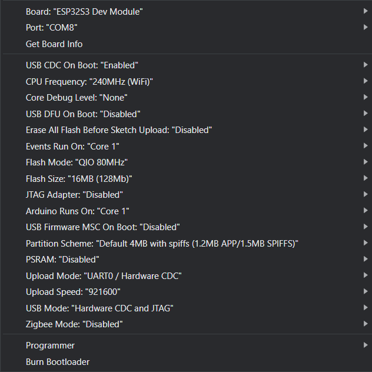
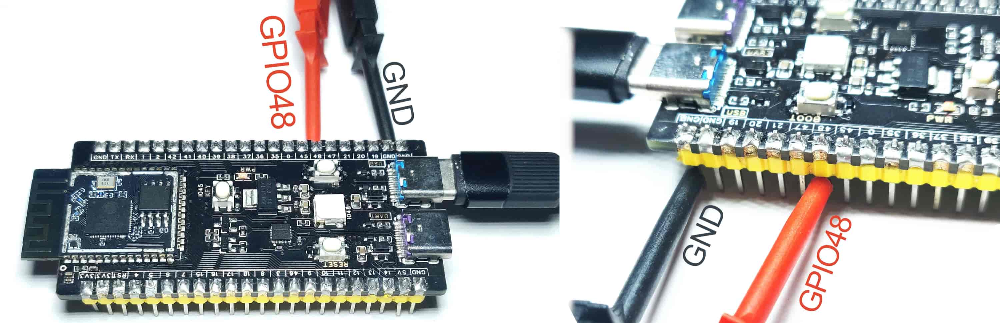
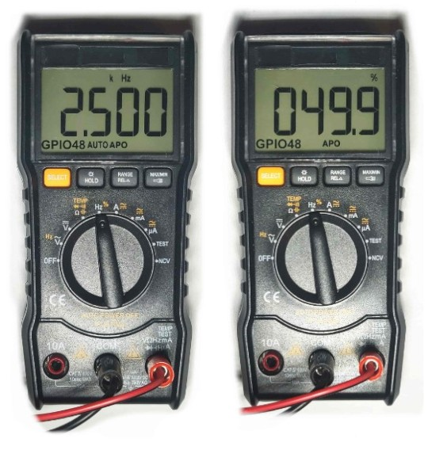
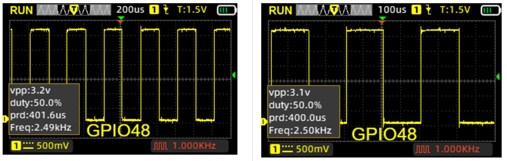

# ESP32-TIM-INT-ARDUINO
 Simple ESP32 Hardware Timer Interrupt with tests using frequency counter and oscilloscope
* Article (EN): https://refcircuit.com/articles/857-simple-timer-interrupt-esp32-s3-arduino-work-example.html
___
* ESP32-S3 N16R8 (tested on)
* Arduino IDE 2.3.3 (tested on)
* Arduino ESP32 3.0.1 (tested on)
 ## Arduino Configurations
  Check Flash Size of your board (in my case it's 16MB).
  Enable USB CDC is you're use it for flashing and debbuging.
   
 ## How to set frequency?
 The final equation is here (obviously ESP32 has limitations, so you can't use any numbers):

 $$f_{TIM} = \frac{TIM_{FREQ}}{TIM_{PER}} = \frac{1000000}{200} = 5000 Hz = 5 kHz$$

    timer = timerBegin(1000000); // TIM_FREQ
    timerAttachInterrupt(timer, &onTimer);
    timerAlarm(timer, 200, true, ); // TIM_PER
 ## Tests
 *The period of the generated signal will be twice bigger (2*200 us=400 us) than actual timer interrupt frequency because we make pin toggle each time when we enter the handler.
 ### Connection
   
 ### Frequency Counter
   
 ### Oscillosope
   
